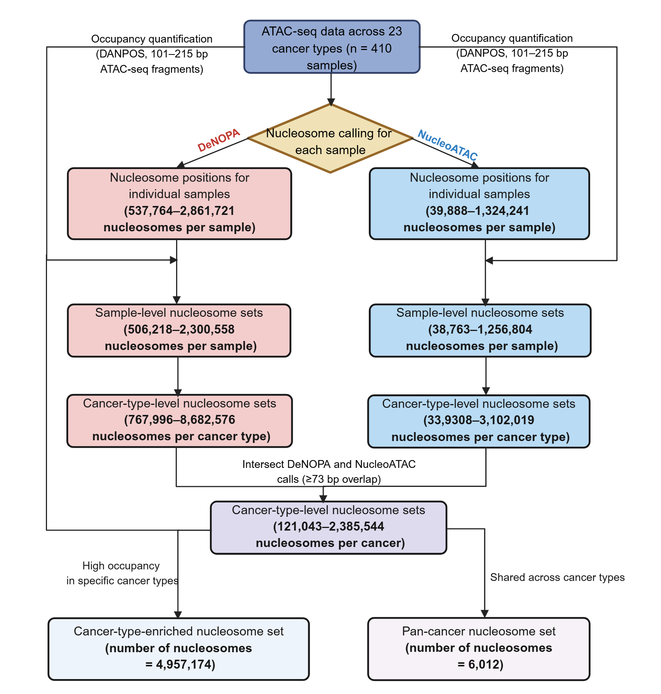

# Pan_cancer_nucleosome_atlas

# Pan-cancer Nucleosome Atlas Based on ATAC-seq

This repository contains scripts used to construct and analyze a pan-cancer nucleosome atlas based on ATAC-seq data. The analysis includes sequencing data preprocessing, nucleosome occupancy calculation, pan-cancer nucleosome atlas construction, nucleosome positioning quality control, motif enrichment analysis, cancer subtype analysis, differential nucleosome analysis, and cfDNA-based cancer detection and classification.

## 1. DataProcessing/

This directory contains scripts used for preprocessing sequencing data and calculating nucleosome occupancy from ATAC-seq and MNase-seq datasets.

* `MNase_seq_data_process.sh`:
  This script is used to process MNase-seq sequencing data, including data preprocessing and nucleosome positioning analysis using DANPOS.

* `ATAC_seq_data_process.sh`:
  This script is used for ATAC-seq data preprocessing and nucleosome positioning analysis using deNOPA and NucleoATAC.

* `Nucleosome_occupancy_calculation.sh`:
  This script is used to calculate nucleosome occupancy from ATAC-seq and MNase-seq data using DANPOS, including mononucleosomal fragment selection (ATAC-seq), occupancy normalization, and generation of bigWig files.

## 2. DataAnalysis/

This directory contains scripts for downstream analyses of the pan-cancer nucleosome atlas.

### 2.1 Pan_cancer_nucleosome_atlas_construction/

This directory contains scripts used to construct the pan-cancer nucleosome atlas and identify cancer-associated nucleosome features.

* `sample_nucleosome_set.R`:
  This script is used to generate sample-level nucleosome sets for individual samples.

* `cancer_nucleosome_set.R`:
  This script is used to identify and generate cancer-type-level nucleosome sets across cancer samples.

* `cancer_type_enrich_nucleosome.R`:
  This script is used to identify cancer-type-enriched nucleosome set with higher occupancy in specific cancer types.

* `Pan_cancer_nucleosome.R`:
  This script is used to identify nucleosomes shared across 23 cancer types to construct a pan-cancer nucleosome set.

* `DeNOPA_overlap_nucleoATAC.R`:
  This script is used to identify cancer-type-level nucleosome sets identified by both deNOPA and NucleoATAC.

### 2.2 Nucleosome_position_pattern_QC/

This directory contains scripts used to evaluate the quality and characteristics of nucleosome positioning patterns.

* `Nucleosome_density_calculate.py`:
  This script is used to calculate nucleosome density and characterize nucleosome positioning patterns around genomic features, such as transcription start sites (TSSs).

### 2.3 Homer_motif_analysis/

This directory contains scripts used for transcription factor motif enrichment analysis of nucleosome-associated genomic regions.

* `homer.sh`:
  This script is used to perform transcription factor motif enrichment analysis using HOMER.

### 2.4 Tsne_based_on_nucleosome/

This directory contains scripts used to perform clustering of 410 samples across 23 cancer types based on nucleosome features.

* `DensityClust_cluster_decision_plot.R`:
  This script is used to perform clustering using DensityClust and visualize the resulting clusters.

* `Tsne_based_on_nucleosome.R`:
  This script is used to perform dimensionality reduction and visualize clustering profiles using t-SNE.

### 2.5 Cancer_subtyping_analysis/

This directory contains scripts used to identify cancer subtypes based on nucleosome profiles.

* `Cancer_subtype_kmeans_based_on_nucleosome.R`:
  This script is used to identify molecular subtypes within individual cancer types based on nucleosome profiles using K-means clustering.

* `Subtype_specific_nucleosome_select.R`:
  This script is used to identify nucleosomes associated with specific cancer subtypes.

### 2.6 Differential_nucleosome_analysis/

This directory contains scripts used to identify differential nucleosome positioning between cancer and normal/PBMC samples.

* `Differential_nucleosome_after_RUVg.R`:
  This script is used to identify differential nucleosomes after RUVg-based correction of unwanted variation.

### 2.7 Cancer_detection_and_classification/

This directory contains scripts used to evaluate the potential of nucleosome features for cancer detection and cancer-type classification using cfDNA.

* `cfDNA_cancer_detection_validation.R`:
  This script is used to evaluate the performance of nucleosome-based cancer detection models in independent cfDNA validation cohorts.

* `cfDNA_cancer_detection_CV.R`:
  This script is used to evaluate cancer detection performance using 10 fold cross-validation in cfDNA datasets.

* `cfDNA_cancer_classification.R`:
  This script is used to develop and evaluate cfDNA-based multi-class cancer classification models using nucleosome features.

## Authors

[ymli12@suda.edu.cn](mailto:ymli12@suda.edu.cn)

[syang2003@stu.suda.edu.cn](mailto:syang2003@stu.suda.edu.cn)

## License

These scripts are provided for academic research purposes only.
Commercial use is not permitted without prior permission from the authors.
